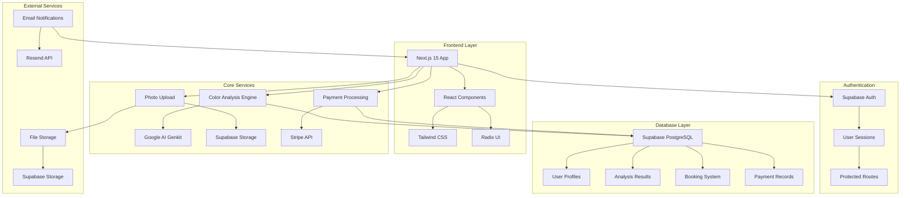
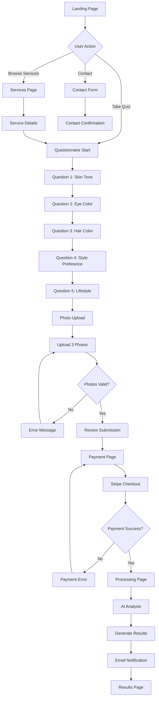

# AuraColor Architecture & User Workflow

## System Architecture



## User Workflow

### Primary Journey: Color Analysis Service



## Component Architecture

```
app/
├── layout.tsx                 # Root layout
├── page.tsx                   # Landing page
├── questionnaire/
│   ├── page.tsx              # Main questionnaire
│   └── components/
│       ├── QuestionCard.tsx
│       ├── PhotoUpload.tsx
│       └── ProgressBar.tsx
├── services/
│   └── page.tsx              # Services overview
├── results/
│   └── [id]/page.tsx         # Dynamic results page
├── auth/
│   ├── login/page.tsx
│   └── callback/page.tsx
├── api/
│   ├── analyze/route.ts      # AI analysis endpoint
│   ├── upload/route.ts       # Photo upload
│   ├── payment/route.ts      # Stripe integration
│   └── webhook/route.ts      # Payment webhooks
└── admin/
    └── page.tsx              # Admin dashboard
```

## Data Flow

### 1. User Registration & Authentication
```
User Input → Supabase Auth → Session Token → Protected Routes
```

### 2. Questionnaire Submission
```
Form Data → Validation → Supabase DB → Analysis Queue
```

### 3. Photo Processing
```
File Upload → Supabase Storage → URL Generation → Analysis Input
```

### 4. AI Analysis
```
User Data + Photos → Google AI Genkit → Color Analysis → Results Storage
```

### 5. Payment Processing
```
Stripe Checkout → Webhook → Database Update → Email Trigger
```

## Database Schema

```sql
-- Users table (Supabase Auth)
users (
  id UUID PRIMARY KEY,
  email TEXT,
  created_at TIMESTAMP
)

-- User profiles
profiles (
  id UUID REFERENCES users(id),
  full_name TEXT,
  phone TEXT,
  preferences JSONB
)

-- Questionnaire responses
questionnaire_responses (
  id UUID PRIMARY KEY,
  user_id UUID REFERENCES users(id),
  skin_tone TEXT,
  eye_color TEXT,
  hair_color TEXT,
  style_preference TEXT,
  lifestyle TEXT,
  photos TEXT[],
  created_at TIMESTAMP
)

-- Analysis results
analysis_results (
  id UUID PRIMARY KEY,
  user_id UUID REFERENCES users(id),
  questionnaire_id UUID REFERENCES questionnaire_responses(id),
  season_type TEXT,
  color_palette JSONB,
  recommendations JSONB,
  confidence_score FLOAT,
  created_at TIMESTAMP
)

-- Payments
payments (
  id UUID PRIMARY KEY,
  user_id UUID REFERENCES users(id),
  stripe_payment_id TEXT,
  amount INTEGER,
  status TEXT,
  created_at TIMESTAMP
)
```

## API Endpoints

### Public Routes
- `GET /` - Landing page
- `GET /services` - Services overview
- `POST /api/contact` - Contact form

### Protected Routes
- `GET /questionnaire` - Color analysis form
- `POST /api/questionnaire` - Submit questionnaire
- `POST /api/upload` - Photo upload
- `POST /api/payment` - Create payment intent
- `GET /results/[id]` - View analysis results

### Admin Routes
- `GET /admin` - Admin dashboard
- `GET /api/admin/users` - User management
- `GET /api/admin/analytics` - Usage analytics

## Security Features

- **Authentication**: Supabase Row Level Security (RLS)
- **File Upload**: Signed URLs with expiration
- **Payment**: Stripe secure checkout
- **API Protection**: JWT token validation
- **Data Privacy**: GDPR compliant data handling

## Performance Optimizations

- **Image Optimization**: Next.js Image component
- **Caching**: Static generation for public pages
- **Code Splitting**: Dynamic imports for heavy components
- **CDN**: Supabase Storage for file delivery
- **Database**: Indexed queries for fast lookups